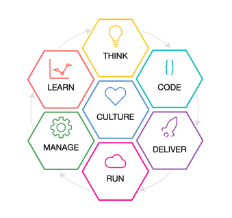
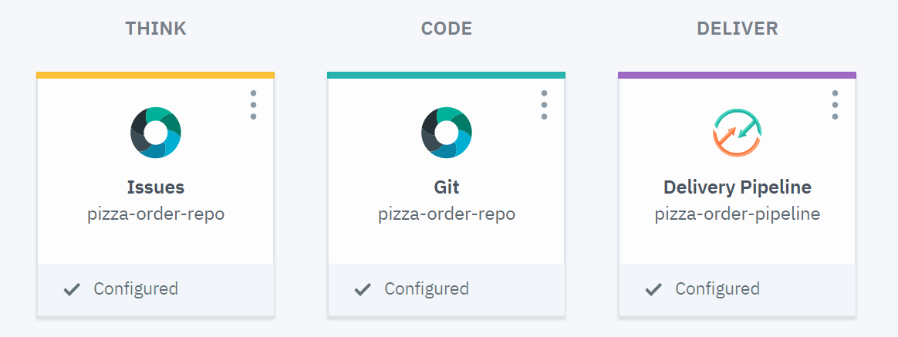

# think-code-deliver


This is a tutorial to adopt Garage Method through agile development and continuous delivery in order to build innovative solutions. We will deploy a node.js web app that is integrated with Watson Assistant to have a pizza-ordering chatbot.

## Prerequisites
 1. You must have an [IBM Cloud account](https://ibm.biz/BdZzHH).
 2. A [GitHub account](https://github.com/join).
### Step 1: Build Your Own Toolchain
1. [Log in](https://ibm.biz/BdZzHH) to IBM Cloud.
2. In the upper-left corner, click the **Menu** icon.
3. Select **DevOps**.
4. Click **Create a Toolchain**.
5. Choose **Build your own toolchain**.

    Change the toolchain's name if you want, but make sure that the toolchain's name is unique within IBM Cloud*.
6. Click **Create**.

After seconds, your new toolchain's page opens.
### Step 2: Add and Configure tool integrations
In the first stage, the toolchain will be composed of two tools:
* Git Repos and Issue Tracking for source control.
* Delivery Pipeline	to automate development, testing and delivery.
#### Add Github Tool
1. Click the **Add a Tool** button.
2. Select **Git Repos and Issue Tracking**.
    - For repository type, select **Clone**.
    - Enter a name for your cloned repository.
    - For the Source repository URL, enter
    `https://github.com/IBM/watson-conversation-slots-intro`
3. Click **Create**.
#### Add a Delivery Pipeline
1. Click the **Add a Tool** button again.
2. Select **Delivery Pipeline**.
    - Enter a name for your pipeline.
    - Select *Show apps in the View app menu*.
3. Click **Create**.
You'll end up with a toolchain similar to this one:

The Delivery Pipeline isn't yet configured for you. We need to add build and deploy stages to make it work.
##### Add a build stage
1. On the Overview page, click on the created delivery pipeline to configure it.
2. Click **Add Stage**.
3. Change the stage's name to *BUILD*.
4. Click the **JOBS** tab, click **Add Job**, and select **Build**.
5. Select **Simple** as a builder type
6. Click **SAVE**.
##### Add a deploy stage
1. Back to the delivery pipeline page.
2. Click **Add Stage**.
3. Change the stage's name to *DEPLOY*.
4. Click on **INPUT** tab
    - Input type should be **Build artifacts**.
    - Select **BUILD** from Stage drop-down menu.
    - Select **Build** from Job drop-down menu.
5. Click on **JOBS** tab.
    - Click **Add Job**, and select **Deploy**.
    - Select **Cloud Foundry** as a deployer type.
    - Choose a location, organization and space.
    - Enter your app name. *Note that the name must be unique*.
    - In Deploy script, replace it with this code
    ```
    #!/bin/bash
    cf create-service conversation standard wcsi-conversation-service
    cf push "${CF_APP}"
    ```
6. Click **SAVE**.

Now from your delivery pipeline page, run BUILD stage. After build is succeeded, DEPLOY stage will automatically start.
DEPLOY stage might take longer time, but once it finished you can see the link of your app!
In case the stage failed, click **View logs** to diagnose the issue.


## Let's make it cognitive!
Let's consider the customer emotions in our response.
If the customer asks
**“Where is my pizza?”**
We return the standard reply
**“The driver has just left, he’ll be ten minutes.”**
After an hour of delay, and the driver still hasn’t arrived, the customer would probably be more angry and ask again
**“Where the heck is my pizza? I ordered an hour ago! This is ridiculous.”**
At this point, the standard reply will make things worse!
Building bots that can understand emotional tone will enable us to send a suitable response, rather than infuriating our hungry customers 😊
### Step 3: Edit Conversation Service
1. On your IBM Cloud Dashboard, click on **wcsi-conversation-service** service.
2. On the **Intents** tab, click **Add intent**.
3. Name it *deliver*, and then click **Create intent**.

    A `#` is prepended to the intent name you specify. The `#deliver` intent indicates that the user wants to ask about delivery.
4. In the Add user example field, type `$where* pizza`, and then click **Add example**
5. Click on **Dialog** tab, then click **Add node**.
6. In the condition field, type **#deliver**, then click on **+** button to type **$emotion:anger** as a second condition.

    This will check if the user is asking about delivery and emotion variable indicates he is angry
7. In the response field, enter `Please accept our apologies for the delivery driver being very late. Could you call us on 0800 800 800 and we'll get this fixed`
8. Click **X** to close the node edit view.
9. Click **Add node** again.
6. In the condition field, type **#deliver**, then click on **+** button to type **!$emotion:anger** as a second condition.

    This will check if the user is asking about delivery and emotion variable indicates he is *not* angry
7. In the response field, enter `I've just checked and the driver is ten minutes away, is there anything else I can help with?`

Now we need to edit the code to add *Watson Tone Analyzer* service to return emotional tone and we'll send it as a value to *emotions* variable to the chatbot.

### Step 4: Create Watson Tone Analyzer Service
1. Back to IBM Cloud dashboard, click the **Menu** icon in the upper-left corner.
3. Select **Watson**.
4. Click **Tone Analyzer**, then **create**.
5. From the left menu, click on Service credentials.
6. Click on **New credential** and then on **Add** to create the service credentials.
7. Click on **View credentials** to save the *Username* and *Password* somewhere safe for later use.


### Step 5: Add Eclipse Web IDE
1. Go to your toolchain in IBM Cloud and click on **Add tool**
2. Select **Eclipse Orion Web IDE**
3. Click on the icon to edit the code! :)
### Step 5: Edit the code
1. Before post function in app.js, import and create instance of Tone Analyzer service
```js
var ToneAnalyzerV3 = require('watson-developer-cloud/tone-analyzer/v3');

var toneAnalyzer = new ToneAnalyzerV3({
  username: 'YourUsername',
  password: 'YourPassword ',
  version: '2016-05-19',
  url: 'https://gateway.watsonplatform.net/tone-analyzer/api/'
});

const getEmotion = (text) => {
  return new Promise((resolve) => {
    let maxScore = 0;
    let emotion = null;
    toneAnalyzer.tone({text: text}, (err, tone) => {
      let tones = tone.document_tone.tone_categories[0].tones;
      for (let i=0; i<tones.length; i++) {
        if (tones[i].score > maxScore){
          maxScore = tones[i].score;
          emotion = tones[i].tone_id;
        }
      }
      resolve({emotion, maxScore});
    });
  });
};
```
2. In the post function and after defining the payload, replace existing code with the following:
```js
getEmotion(req.body.input.text).then((detectedEmotion) => {
      payload.context.emotion = detectedEmotion.emotion;
      conversation.message(payload, (err, data) => {
        if (err) {
            return res.status(err.code || 500).json(err);
        }
        return res.json(updateMessage(payload, data));
      });
});
```
3. Then, from the top menu click on **File** then **Save** the changes
4. Click on Git icon on the left menu
5. Click **commit** then **push** to push commits made on your local branch to a remote repository.

## Credits
Thanks for James Thomas for his [amazing article](jamesthom.as/blog/2016/05/10/bots-with-ibm-watson/)

## Contributors

Thanks goes to these wonderful people:

<!-- ALL-CONTRIBUTORS-LIST:START - Do not remove or modify this section -->
<!-- prettier-ignore -->
| [<br /><sub><b>Nora AlNashwan</b></sub>](https://twitter.com/xnorax)<br />[💻](#Contributors "Code") [📖](#Contributors "Documentation") |
| :---: |

This project follows the [all-contributors][all-contributors] specification.
Contributions of any kind are welcome!

[all-contributors]: https://github.com/kentcdodds/all-contributors
